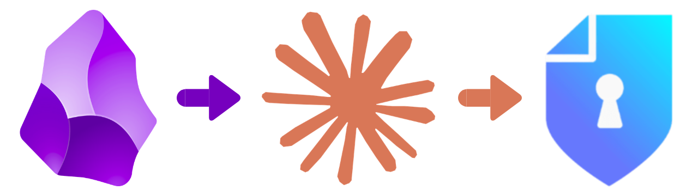

# AI-PWNDOC

Automated vulnerability writing for [PwnDoc](https://github.com/pwndoc/pwndoc) using AI.

Takes a folder of Obsidian-style `.md` notes — one per vulnerability — analyses the text and any embedded screenshots, and pushes fully structured findings directly into a PwnDoc audit. Supports **Claude** (via Anthropic API) and **Gemini** (via CLI).



---

## Project structure

```
├── ai-pwndoc.py
├── config.yml
├── requirements.txt
├── vulnerabilities.yml
└── SampleAudits
    ├── ADPentest
    │   ├── AS-REP ROASTING.md
    │   ├── AS-REP1.png
    │   ├── AS-REP2.png
    │   ├── AS-REP3.png
    │   ├── RBCD1.png
    │   ├── RBCD2.png
    │   ├── RBCD3.png
    │   └── Resource-Based Constrained Delegation.md
    └── WebAudit
        ├── MA1.png
        ├── MA2.png
        ├── MA3.png
        ├── MASS ASSIGMENT.md
        ├── Server-Side Template Injection.md
        ├── SSTI1.png
        └── SSTI2.png
```

---

## How it works

Each `.md` is an auditor's raw note. Images are referenced inline using Obsidian syntax (`![[image.png]]`) and must sit in the same folder as the note. The script:

1. Parses each note and extracts embedded image references
2. Calls the AI to generate structured vulnerability JSON (title, description, observation, remediation, CVSS, etc.)
3. Calls the AI again per image to generate a technical description and caption
4. Uploads images to PwnDoc and assembles the `poc` field with descriptions + inline images + `alt` captions
5. Pushes the finding to the selected audit

---

## Requirements

```bash
pip3 install -r requirements.txt
```

`requirements.txt` includes: `requests`, `urllib3`, `pyyaml`, `rich`.

For **Gemini**: install the [Gemini CLI](https://github.com/google-gemini/gemini-cli) and authenticate.  
For **Claude**: only the Anthropic API key is needed — no CLI required.

---

## Configuration

Create `config.yml` at the project root (next to `ai-pwndoc.py`):

```yaml
# ─────────────────────────────────────────
# AI-PWNDOC : CONFIGURATION
# ─────────────────────────────────────────

pwndoc:
  base_url: "https://localhost:8443"
  username: "admin"
  password: "admin"
  verify_ssl: false

llm:
  provider: "claude"           # claude | gemini
  anthropic_api_key: "sk-ant-..."
  claude_model: "claude-haiku-4-5"   # default model
```

---

## Examples file

Pass a `.yml` with real vulnerability examples from past reports. The AI learns your writing style, tone, and technical level from them.

```yaml
- title: "SQL Injection in login endpoint"
  vulnType: "Web"
  description: "The login form is vulnerable to SQL injection..."
  observation: "By sending a payload of ' OR 1=1-- ..."
  remediation: "Use parameterised queries or a prepared statement ORM."
  remediationComplexity: 2
  priority: 4
  references:
    - "https://owasp.org/www-community/attacks/SQL_Injection"
  cvssv3: "CVSS:3.1/AV:N/AC:L/PR:N/UI:N/S:U/C:H/I:H/A:H"
```

---

## Usage

```bash
# Run from the project root
python ai-pwndoc.py <audit-folder> -e vulnerabilities.yml [options]
```

### Arguments

| Argument | Short | Description |
|---|---|---|
| `folder` | | Folder containing `.md` notes |
| `--examples` | `-e` | `.yml` file with vulnerability examples (**required**) |
| `--provider` | `-p` | AI provider: `claude` or `gemini` (overrides config) |
| `--model` | `-m` | Claude model override (overrides config) |
| `--config` | `-c` | Path to config file (default: `config.yml`) |
| `--audit-id` | | PwnDoc audit ID — skips interactive selection |
| `--lang` | | Output language: `es` (default) or `en` |
| `--instructions` | | Additional instructions injected into the system prompt |
| `--dry-run` | | Run the full AI pipeline but do not upload to PwnDoc |
| `--no-images` | | Skip image analysis and upload |

### Examples

```bash
# Basic run — interactive audit selection
python ai-pwndoc.py SampleAudits/WebAudit/ -e vulnerabilities.yml

# English output, Gemini provider
python ai-pwndoc.py SampleAudits/WebAudit/ -e vulnerabilities.yml --provider gemini --lang en

# Use a more powerful Claude model
python ai-pwndoc.py SampleAudits/ADPentest/ -e vulnerabilities.yml --model claude-opus-4-5

# Inject extra instructions into the prompt
python ai-pwndoc.py SampleAudits/WebAudit/ -e vulnerabilities.yml --instructions "Always include the CWE identifier in the description."

# Skip interactive audit selection
python ai-pwndoc.py SampleAudits/ADPentest/ -e vulnerabilities.yml --audit-id 6657f1a2c3b4e500123abc

# Test without uploading anything
python ai-pwndoc.py SampleAudits/WebAudit/ -e vulnerabilities.yml --dry-run

# Full run, English, specific audit, best model
python ai-pwndoc.py SampleAudits/ADPentest/ -e vulnerabilities.yml \
  --lang en \
  --model claude-opus-4-5 \
  --audit-id 6657f1a2c3b4e500123abc
```

---

## Note format

Notes are plain Markdown files. Images are referenced using Obsidian wikilink syntax. Images must be in the same folder as the note (or any subfolder).

```markdown
# IDOR on invoice endpoint

Reviewing the billing app I noticed the endpoint `/api/invoices/{id}` does not
validate that the ID belongs to the authenticated user.

## What I found

Sequential IDs work fine with other users' data:

![[burp_request.png]]

The response leaks full invoice data: name, address, VAT number, amounts.

![[json_response.png]]

## Impact

Any authenticated user can read every other customer's invoice.
~50k users → ~50k invoices exposed.
```

The script replaces image references with `[EVIDENCE N: filename]` placeholders before sending the text to the AI, then analyses each image separately for description and caption.


